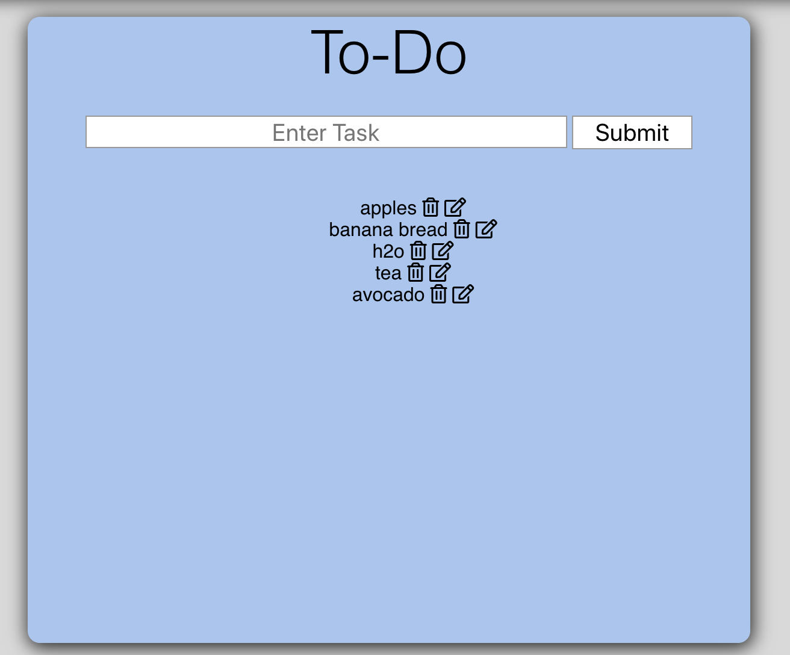

#crud-express-group

Installation:
Clone repo
run npm install

Usage:
run npm run todo
Navigate to localhost:3000

Tech Used: HTML, CSS, Node.JS, Express, MongoDB, Javascript

This application is a to do list that lets you post, update, and delete tasks for optimal organization. While building this application I focused on comprehending CRUD, Express, and how to connect the front end to the back end. That connection is made using express modules, node, mongodb, and the server localhost 3000.
